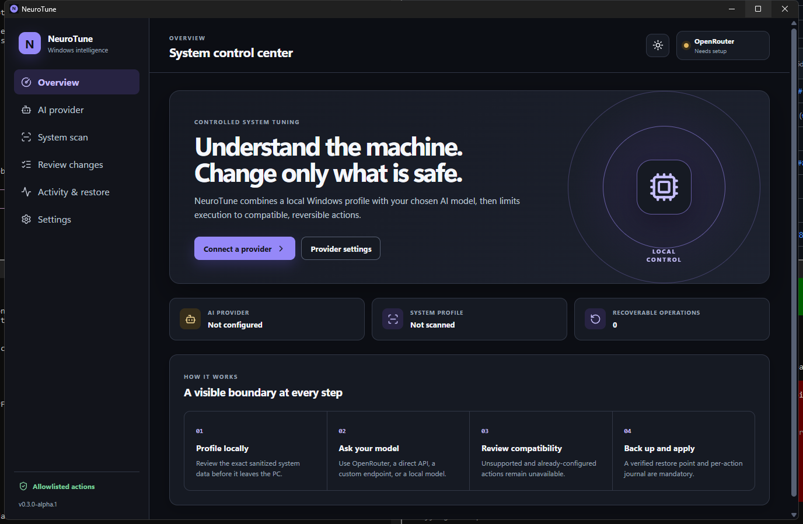

  <h1>🧠 NeuroTune</h1>
  
<strong>AI-assisted Windows optimization with safety boundaries and reliable rollback.</strong>

  

    NeuroTune profiles your PC, requests contextual recommendations from your preferred LLM,
    and applies only predefined, reversible system changes.
  

  

    
    
    
    
    
  

<h2>⚡ What NeuroTune Does</h2>

<ol>
  <li>Collects a local Windows hardware and software profile.</li>
  <li>Sends the sanitized profile to your selected cloud, custom, or local model endpoint.</li>
  <li>Accepts recommendations only when they reference an action in the built-in allowlist.</li>
  <li>Creates a System Restore point and Registry backups before changing anything.</li>
  <li>Applies verified optimizations and records the previous state for one-click rollback.</li>
</ol>

<h2>🔒 Safety Model</h2>

<table>
  <thead>
    <tr>
      <th>Protection</th>
      <th>Behavior</th>
    </tr>
  </thead>
  <tbody>
    <tr>
      <td>Typed capability registry</td>
      <td>The LLM can select known <code>ActionId</code> values. Generated scripts remain reviewable artifacts and have no execution path inside NeuroTune.</td>
    </tr>
    <tr>
      <td>Verified diagnosis evidence</td>
      <td>Each model finding must return an exact evidence ID and value from the local scan or the response is rejected.</td>
    </tr>
    <tr>
      <td>Fail-closed backups</td>
      <td>No optimization runs if the required restore point or Registry backup fails.</td>
    </tr>
    <tr>
      <td>Transactional execution</td>
      <td>Actions are applied and verified individually; failures trigger reverse-order rollback.</td>
    </tr>
    <tr>
      <td>Protected credentials</td>
      <td>API keys are encrypted for the current Windows user with DPAPI and excluded from logs.</td>
    </tr>
    <tr>
      <td>Profile transparency</td>
      <td>The application shows the exact evidence facts sent to the provider and redacts the Windows username and device name.</td>
    </tr>
  </tbody>
</table>

<blockquote>
  <strong>Important:</strong> System optimization always carries risk. Test NeuroTune in a Windows virtual machine before using it on a primary PC, and keep an independent backup.
</blockquote>

<h2>Features</h2>

<ul>
  <li><strong>Deep evidence inventory:</strong> 83 typed Registry probes plus BCD, drivers, devices, filters, software, firmware, DIMMs, power, gaming, networking, runtime, and startup state.</li>
  <li><strong>Flexible model connections:</strong> OpenRouter, OpenAI, Anthropic, DeepSeek, any OpenAI-compatible or Anthropic-compatible API, Ollama, LM Studio, and vLLM.</li>
  <li><strong>Official browser authorization:</strong> OpenRouter OAuth with PKCE; providers without a supported third-party authorization flow continue to use API credentials.</li>
  <li><strong>Native web UI:</strong> Tauri 2 and React with high-contrast light/dark themes, Windows appearance synchronization, and manual override.</li>
  <li><strong>Guided workflow:</strong> Setup, local scan, AI diagnosis, compatibility review, apply, measure, and restore.</li>
  <li><strong>Goal-aware diagnosis:</strong> tell the model which games or workloads matter and prioritize frame rate, system latency, network latency, balance, or efficiency.</li>
  <li><strong>Explicit conflict graph:</strong> names the exact settings and values involved, including timer, filter/VPN, overlay, memory, device, power, and recovery relationships.</li>
  <li><strong>Cancellable scans:</strong> cancellation terminates only the matching agent process tree and never keeps a partial profile.</li>
  <li><strong>Reviewable payload limits:</strong> shows evidence fact count, UTF-8 size, privacy classes, and the enforced single-pass limit before diagnosis.</li>
  <li><strong>Exact local baselines:</strong> versioned CPU and memory references match exact component identifiers; unknown hardware reports <code>baseline unavailable</code>.</li>
  <li><strong>User-controlled plans:</strong> switch between AI recommendations, conflict fixes, and every supported reversible action; risk changes warnings, not visibility.</li>
  <li><strong>Current allowlisted actions:</strong> power, gaming, graphics, visual, memory, GPU-timeout, and legacy TCP repairs with local capture, verification, and rollback.</li>
  <li><strong>Local ETW measurements:</strong> bounded WPR captures for an already-running workload, deterministic ISR/DPC and scheduler analysis, repeated comparisons, and raw-trace deletion by default.</li>
  <li><strong>Local operation history:</strong> Per-action state snapshots and rollback from the desktop interface.</li>
  <li><strong>Honest telemetry boundary:</strong> low-level capabilities remain read-only and unavailable or driver-not-approved until a separate adapter and driver trust review is complete.</li>
</ul>

<h2>Requirements</h2>

<ul>
  <li>A Microsoft-supported Windows 11 build, x64</li>
  <li>Administrator privileges</li>
  <li>System Protection enabled on the Windows drive</li>
  <li>A supported API credential, OpenRouter browser account, or local OpenAI-compatible model server</li>
  <li>For source builds: .NET 8 SDK, Node.js 24, Rust stable, and the Visual Studio C++ desktop workload</li>
</ul>

<h2>Build from Source</h2>

Run the following commands from an elevated PowerShell terminal:

<pre><code>git clone https://github.com/PrimeBuild-pc/NeuroTune.git
cd NeuroTune
dotnet restore
dotnet build --configuration Release
dotnet test --configuration Release
cd ui
npm ci
npm test
npm run tauri dev</code></pre>

<h3>Publish a Self-Contained Build</h3>

<pre><code>cd ui
npm ci
npm run tauri -- build --bundles nsis</code></pre>

The GitHub Actions workflow produces a <code>NeuroTune-win-x64</code> artifact containing the unsigned per-machine NSIS installer, a no-install portable ZIP with both self-contained agents, and <code>SHA256SUMS</code>.

<h2>Local Data</h2>

Settings, DPAPI-encrypted API keys, redacted logs, Registry exports, and rollback manifests are stored in:

<pre><code>%LocalAppData%\NeuroTune</code></pre>

No API key or runtime profile is committed to this repository.

<h2>Project Status</h2>

  NeuroTune v0.7.0-alpha.1 is an <strong>unsigned alpha</strong> intended for controlled testing. The project is MIT-licensed and
  produces an unsigned NSIS installer, a no-install portable ZIP, and SHA-256 checksums.
  Generated scripts may be reviewed or saved, but NeuroTune executes only typed, locally registered, reversible
  capabilities. Destructive cleanup and arbitrary model-generated writes remain excluded.

<h2>Documentation</h2>

<ul>
  <li><a href="ROADMAP.md">Product roadmap and release criteria</a></li>
  <li><a href="docs/IMPLEMENTATION_PLAN.md">Implementation plan</a></li>
  <li><a href="docs/DESIGN_SYSTEM.md">Design system and theme contract</a></li>
  <li><a href="docs/PROVIDERS.md">Cloud, custom, OAuth, and local provider guide</a></li>
  <li><a href="docs/TESTING.md">Alpha test guide</a></li>
  <li><a href="docs/VALIDATION_MATRIX.md">VM, accessibility, scaling, and hardware validation matrix</a></li>
  <li><a href="docs/PAWNIO_TRUST_REVIEW.md">PawnIO / LibreHardwareMonitor trust decision</a></li>
  <li><a href="docs/SECURITY_AUDIT_2026-08-02.md">Pre-publication security and privacy audit</a></li>
  <li><a href="RELEASE_NOTES.md">v0.7.0-alpha.1 release notes</a></li>
  <li><a href="LICENSE">MIT license</a></li>
  <li><a href="SECURITY.md">Security policy</a></li>
</ul>
