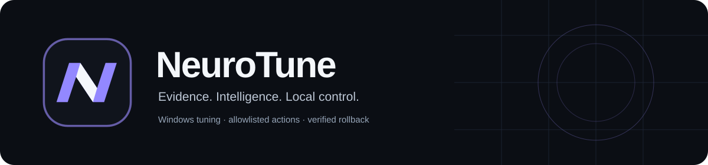
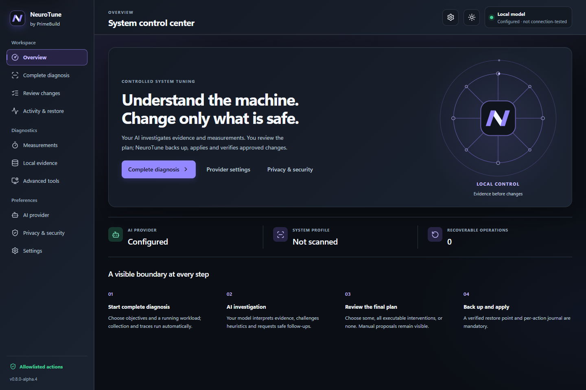
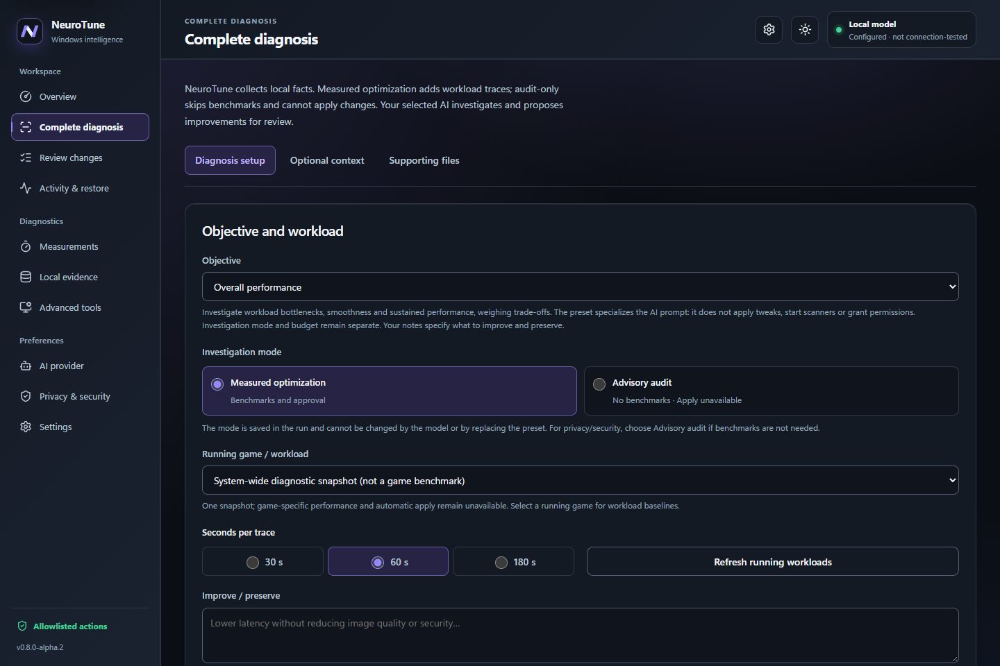
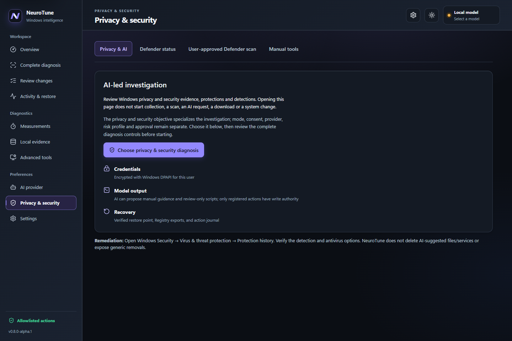
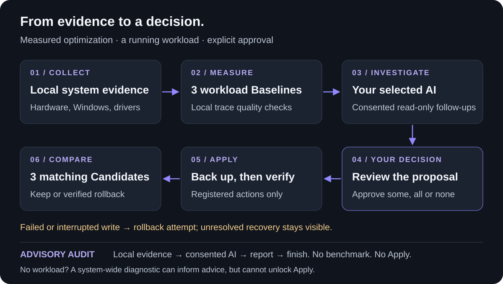
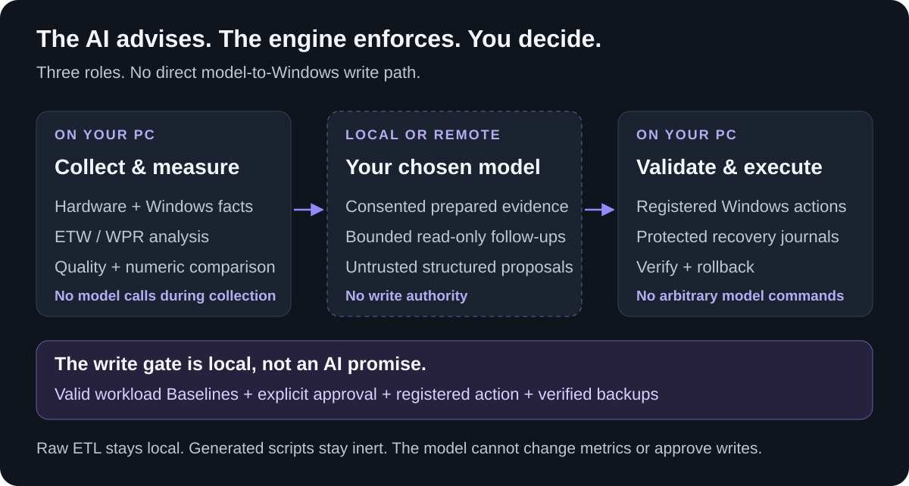

  
  
<strong>AI-powered Windows 11 optimizer — free and open source.</strong>

  
Measure first. Let your AI investigate. Review every change.

  

    
    
    
    
    
  

  

    <a href="#highlights">Highlights</a> ·
    <a href="#interface">Interface</a> ·
    <a href="#workflow">Workflow</a> ·
    <a href="#trust-boundaries">Trust boundaries</a> ·
    <a href="#build-from-source">Build from source</a> ·
    <a href="https://github.com/PrimeBuild-pc/NeuroTune/releases">Alpha releases</a>
  

NeuroTune combines <strong>local measurements</strong>, an <strong>AI investigation</strong> and a <strong>bounded Windows execution engine</strong> to investigate performance, latency, networking, stability and privacy/security. It is not a one-click tweak pack: a recommendation is a hypothesis, not proof of a benefit.

<blockquote>
  
<strong>NeuroTune v0.8.0-alpha.1 is an unsigned alpha for controlled testing, not a stable/general release.</strong> Current sources still require a rebuilt, exact-candidate installer and fresh Windows 11 VM acceptance. Old installers, historical test results and a green build badge do not certify the current sources. Use a disposable VM for system-changing tests and keep an independent backup.

</blockquote>

<strong>Free software, not a promise of free inference.</strong> NeuroTune is MIT-licensed. Your chosen remote provider may charge for API use or require eligible plan credits; local models need your own hardware. There is no automatic provider or API-billing fallback.

<h2>Built around evidence. Designed for control.</h2>
<table>
  <tr>
    <td width="50%" valign="top"><h3>01 · Measure before changing</h3>
Local ETW/WPR analysis, trace-quality checks and repeated Baseline/Candidate comparisons. Numerical results are computed locally, not invented by a model.
</td>
    <td width="50%" valign="top"><h3>02 · Bring your own AI</h3>
OpenRouter, OpenAI, Anthropic, DeepSeek and compatible APIs. Use Ollama, LM Studio or vLLM through a loopback endpoint when you prefer local inference.
</td>
  </tr>
  <tr>
    <td valign="top"><h3>03 · Review every proposal</h3>
See evidence, risks, uncertainty and trade-offs. Approve some registered actions, all available recommendations or none. High-risk actions need separate confirmation.
</td>
    <td valign="top"><h3>04 · Recovery is part of the workflow</h3>
Mandatory verified restore point, required Registry exports and original-state snapshots. Changes are journaled and verified; unresolved recovery stays visible.
</td>
  </tr>
  <tr>
    <td valign="top"><h3>05 · Visible privacy boundaries</h3>
Collection and trace analysis stay local. Provider transmission requires consent; raw ETL is never sent. API/OAuth credentials use Windows DPAPI protection.
</td>
    <td valign="top"><h3>06 · Audit without applying tweaks</h3>
Choose Advisory audit separately: local evidence, consented investigation and a report. No workload benchmark or Apply. Defender scans require their own approval.
</td>
  </tr>
  <tr>
    <td valign="top"><h3>07 · A focused Windows interface</h3>
Tauri 2 + React 19, light/dark/system appearance, reduced-motion support and quiet capture periods. English, Simplified Chinese, Japanese, Spanish and Russian UI.
</td>
    <td valign="top"><h3>08 · Source-visible by design</h3>
MIT-licensed code, registered actions and documented limits. No arbitrary model-generated command execution, generic BIOS writer or automatic security-disable shortcut.
</td>
  </tr>
</table>

<h2>The current interface</h2>

  <picture>
    <source media="(prefers-color-scheme: dark)" srcset="docs/screenshots/neurotune-dark.png">
    <source media="(prefers-color-scheme: light)" srcset="docs/screenshots/neurotune-light.png">
    
  </picture>

Current frontend, captured with an empty mocked Agent. No personal PC data, fabricated benchmark gains, native operations or provider calls.

  
<strong>Explore diagnosis setup and privacy/security</strong>

  <h3>Choose an objective, a mode and a workload</h3>
  
Measured optimization and Advisory audit are separate choices. A preset specializes the prompt; it cannot grant new permissions.

  
  <h3>Privacy advice is not scanner authorization</h3>
  
Opening this page does not start a scan, AI request, download or system change. Scanner operations and manual remediation remain separate.

  

<h2>From evidence to a decision</h2>

<ol>
  <li><strong>Collect locally.</strong> Inventory covers hardware, Windows settings, drivers, devices, software and services. Choose performance, system latency, networking, stability or privacy/security; these specialize the AI prompt, not a preset list of tweaks. BIOS reading is a separate opt-in.</li>
  <li><strong>Measure before diagnosis.</strong> Measured complete diagnosis gives you time to return to an already-running game/app, records three Baselines and checks them locally. Neither AI runs during captures; decorative motion stops. Without a workload, one system-wide diagnostic can inform advice but <strong>cannot unlock Apply</strong>. Keep the scene and settings repeatable yourself.</li>
  <li><strong>Investigate with consent.</strong> Your selected model receives prepared evidence and may request bounded, fixed read-only Windows observations. It can challenge local heuristics. The default budget is 12 turns / 10 minutes, configurable within limits. Failure is reported, not replaced by a supposedly successful automatic plan.</li>
  <li><strong>Review and approve.</strong> Proposals show evidence, risk, uncertainty, trade-offs and reversal requirements. Choose some registered actions, all available recommendations or none. Manual guidance and generated scripts have no execution path inside NeuroTune.</li>
  <li><strong>Apply, verify, recover.</strong> The engine checks availability, approval identity and conflicting selections, creates mandatory backups, then journals and verifies writes. Failure triggers reverse-order rollback; incomplete recovery is not labelled success.</li>
  <li><strong>Test the result.</strong> After any required restart, collect matching Candidates. A 1+1 comparison is exploratory; the repeated decision gate needs at least 3+3 valid captures. Drift, invalid traces, missing coverage or new regressions must not become a favorable Keep recommendation. The AI cannot change metrics or your decision.</li>
</ol>

<strong>Prefer one hypothesis/change at a time.</strong> Multiple approved, nonconflicting actions can be executed together, but that does not isolate each action's contribution.

<strong>Advisory audit is a different path:</strong> local evidence → consented AI investigation → reviewable report → finish. No WPR/workload Baseline or optimization Apply. Complete audits pause on a cancellable prepared-evidence preview before provider transmission. Read the <a href="docs/PRIVACY_SECURITY.md">privacy/security scope and limits</a>.

<h2>Where the AI ends and Windows execution begins</h2>

<table>
  <tr><th>Boundary</th><th>What it means</th></tr>
  <tr><td><strong>AI is advisory</strong></td><td>Exact evidence citations are checked, but do not prove the model's interpretation or optimal tuning. Models cannot supply arbitrary commands, write paths or Registry targets.</td></tr>
  <tr><td><strong>Execution is local and bounded</strong></td><td>Only registered <code>ActionId</code> implementations can write. Qualified capabilities include power/core-parking, gaming/display, per-app GPU preference, page-file and memory/TDR/legacy TCP repair actions. Availability depends on the actual machine.</td></tr>
  <tr><td><strong>Backups are mandatory</strong></td><td>Missing prerequisites, restore-point/backup failures or untrusted journals stop execution. Restore points and app rollback do not replace an independent backup.</td></tr>
  <tr><td><strong>Recovery state is protected</strong></td><td>Operation/run journals require trusted Administrators/SYSTEM ownership and permissions. Unsafe ACLs, reparse paths, corrupt identities and unsupported schemas are rejected, not silently repaired.</td></tr>
  <tr><td><strong>No hidden expansion of authority</strong></td><td>Generated scripts stay inert. GPU IRQ-affinity candidates remain read-only. No generic BIOS writer, firmware flashing, arbitrary cleanup or security-disable shortcut is exposed.</td></tr>
  <tr><td><strong>Scanner consent is separate</strong></td><td>Choosing a privacy objective does not start Defender. Separately approved scans may remediate detections under Defender policy and use network/cloud/sample submission. No AI-selected file deletion or automatic TronScript execution is offered.</td></tr>
</table>

<h2>What the evidence can — and cannot — tell you</h2>
<ul>
  <li><strong>Measured locally:</strong> scheduler Ready Time, per-core activity, ISR/DPC distributions, driver aggregates, hard pagefaults and local spike timelines. Raw traces are deleted after successful analysis unless you opt to retain them.</li>
  <li><strong>Not measured by scheduling/interrupt traces:</strong> FPS, ping/jitter or end-to-end input latency. Interrupt-to-process latency and firmware/SMI stalls remain unmeasured; full LatencyMon parity is not claimed.</li>
  <li><strong>Imported, not certified:</strong> PresentMon-compatible CSV frame aggregates require process attribution and retain unverified session provenance. Supporting reports/screenshots are user-supplied evidence, not verified measurements.</li>
  <li><strong>No universal optimization promise:</strong> a driver name, high spike or low-occupancy core is not causal proof. Missing data is not zero. Physical AMD/NVIDIA workload repeatability and exact recovery remain release gates.</li>
  <li><strong>No whole-PC security certification:</strong> privacy/security reports expose 15 checks across five areas, including missing or unassessed evidence. An empty detection history or scan command returning successfully does not prove a clean PC. Scan operations are not currently linked as verified audit coverage.</li>
</ul>

<h2>Your model. Explicit data boundaries.</h2>

<strong>Main AI:</strong> OpenRouter, OpenAI API, Anthropic, DeepSeek, compatible custom APIs, or loopback servers such as Ollama, LM Studio and vLLM. Official browser authorization is available for OpenRouter and eligible ChatGPT plans/credits; availability and limits are provider-controlled. See the <a href="docs/PROVIDERS.md">provider guide</a>.

Local scans, captures and numerical analysis do not call a model. Consented diagnosis sends prepared evidence to the <strong>selected provider</strong>. A local endpoint keeps that request local; remote providers apply their own processing/retention policies. Common identity/path redaction is best-effort, <strong>not guaranteed anonymization</strong>. A separately enabled optional cloud classifier still has its own transmission boundary.

  
<strong>Optional features: consent, costs and limits</strong>

  <table>
    <tr><th>Feature</th><th>Consent and limits</th></tr>
    <tr><td>Supporting reports/screenshots</td><td>Up to 8 files, including 4 images, with prepared previews and separate transmission consent. Reports are inert text; images require model-vision/cost confirmation. <strong>Pixels are not anonymized</strong> and may be resent each turn. Report text/metadata persist locally; screenshot pixels are transient. User files cannot unlock a measurement gate.</td></tr>
    <tr><td>System One assistant</td><td>Default-off topic advice through a managed local Rizzo component or a separately consented OpenRouter classifier. Local setup downloads multi-GB third-party assets; cloud use has separate credentials/costs. Neither approves writes. No speed/accuracy guarantee; non-admin workers are not filesystem/network sandboxes.</td></tr>
    <tr><td>BIOS inspection / SCEWIN</td><td>BIOS reads are opt-in. Offline imports are unverified. Export requires a user-supplied, hash-approved privileged package and additional consent; third-party drivers can affect the system. No AMI binaries are bundled, no protections are weakened and no BIOS write command is exposed. Live board compatibility remains unverified.</td></tr>
    <tr><td>Defender quick/full scans</td><td>Separate explicit consent and final confirmation. Defender may quarantine/remove detections under its configured policy; network/cloud/sample behavior must be reviewed. Scan return/history is not a clean-PC verdict. Remediation belongs in Windows Security → Protection history; restore points do not guarantee reversal.</td></tr>
  </table>
  
Full evidence rules: <a href="docs/DETERMINISTIC_CONTROLS.md">investigation boundaries</a>. Third-party acceptance: <a href="docs/SCEWIN_SYSTEM_ONE.md">optional components</a>. Scanner policy: <a href="docs/PRIVACY_SECURITY.md">privacy/security scope</a>.

  
<strong>Local storage, credentials and upgrade safety</strong>

  <table>
    <tr><th>Location</th><th>Contents</th></tr>
    <tr><td><code>%LocalAppData%\NeuroTune</code></td><td>Settings, DPAPI-encrypted API/OAuth credentials, redacted logs, measurement reports, optionally retained ETL and disposable caches/components.</td></tr>
    <tr><td><code>%ProgramData%\NeuroTune-journals\&lt;Windows user SID&gt;\operations</code></td><td>Privileged operation manifests, original-state snapshots and required Registry exports.</td></tr>
    <tr><td><code>%ProgramData%\NeuroTune-journals\&lt;Windows user SID&gt;\runs</code></td><td>Privileged evidence, approvals, transitions, comparison decisions and recovery links.</td></tr>
    <tr><td><code>%ProgramData%\NeuroTune-journals\&lt;Windows user SID&gt;\defender-scans</code></td><td>Separate scanner-operation journals, including uncertain/interrupted operations that require review before repeating.</td></tr>
  </table>
  
Protected journals use Administrators/SYSTEM access, bounded reads and flushed atomic replacement. Actual ACL denial, interruption and storage-failure behavior still require VM acceptance. DPAPI protects credentials for the Windows user; it does not defend against every compromised process/account or a tampered elevated executable.

  
<strong>Before upgrading from legacy journals:</strong> use the previous build to review/finish recovery, preserve independent backups and resolve prior writes, then archive the reviewed <code>%LocalAppData%\NeuroTune\operations</code> and <code>runs</code> directories. The new store does not import them and blocks journal operations while legacy entries remain. <strong>Never delete pending recovery or copy old JSON into protected storage to bypass the gate.</strong> See <a href="SECURITY.md">upgrade safety</a>.

<h2>Build from source</h2>
<ul>
  <li>A Microsoft-supported <strong>Windows 11 x64</strong> build and WebView2 runtime.</li>
  <li>Administrator privileges for the desktop app; System Protection enabled for applying changes.</li>
  <li>A supported model connection for AI diagnosis; not needed for local scan/measurement tools.</li>
  <li>.NET 8 SDK, Node.js 24, Rust stable and Visual Studio's C++ desktop workload.</li>
</ul>

From PowerShell:

<pre lang="powershell">git clone https://github.com/PrimeBuild-pc/NeuroTune.git
cd NeuroTune
dotnet restore
dotnet build --configuration Release
cd ui
npm ci
npm test
npm run typecheck
npm run lint
npm run tauri dev</pre>

Launching the app requires normal Windows UAC approval. Integration tests and writer/installer checks belong in a disposable VM; use the <a href="docs/TESTING.md">test guide</a>, not your primary PC.

  
<strong>Build the unsigned installer and portable archive</strong>

  <pre lang="powershell"># From ui/
npm run tauri -- build --bundles nsis
cd ..
./scripts/package-release.ps1</pre>
  
CI produces the <code>NeuroTune-win-x64</code> artifact: a per-machine NSIS installer, a complete portable ZIP containing both self-contained agents, and <code>SHA256SUMS</code>. <strong>Portable means no installation, not no elevation or no persistent data.</strong> Optional model weights, SCEWIN tools and vendor drivers are not bundled. SHA-256 checks identify bytes; they do not authenticate an unsigned publisher or establish safety.

<h2>Documentation and contributing</h2>
<ul>
  <li><a href="SECURITY.md">Security policy and upgrade safety</a> · <a href="RELEASE_NOTES.md">Alpha release notes</a></li>
  <li><a href="docs/TESTING.md">Test guide</a> · <a href="docs/VALIDATION_MATRIX.md">Current gates and historical validation matrix</a></li>
  <li><a href="docs/PROVIDERS.md">Provider guide</a> · <a href="docs/DETERMINISTIC_CONTROLS.md">Investigation/execution boundaries</a></li>
  <li><a href="docs/SCEWIN_SYSTEM_ONE.md">Optional SCEWIN / System One</a> · <a href="docs/PRIVACY_SECURITY.md">Privacy and Windows security</a></li>
</ul>

  
<strong>Historical evidence — not current release certifications</strong>

  
<a href="docs/LOCAL_LATENCY_VALIDATION.md">Local latency validation</a> · <a href="docs/PAWNIO_TRUST_REVIEW.md">PawnIO trust review</a> · <a href="docs/SECURITY_AUDIT_2026-08-02.md">Repository privacy audit</a>. These are scoped records, not current release certifications.

To contribute hardware inventory, use the <a href="tools/hardware-collector/README.md">source-visible hardware collector</a>. It runs offline without administrator rights, traces or settings changes. Review its dated JSON before sharing; inventory is not a performance benchmark.

NeuroTune is <a href="LICENSE">MIT-licensed</a>. Third-party packages and models retain their own licenses and trust requirements. Report vulnerabilities privately through <a href="SECURITY.md">Security advisories</a>, not public issues containing secrets or full PC profiles.

<strong>Evidence before claims. Approval before writes. Recovery before moving on.</strong>

  
  
  

