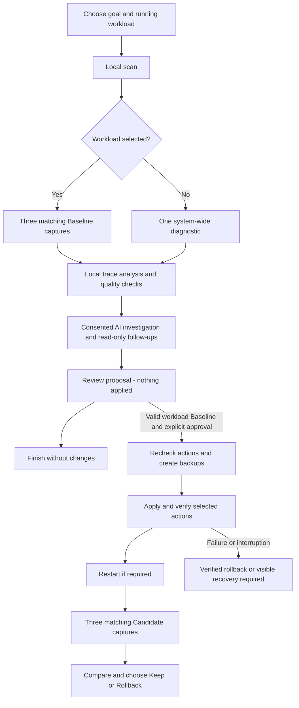
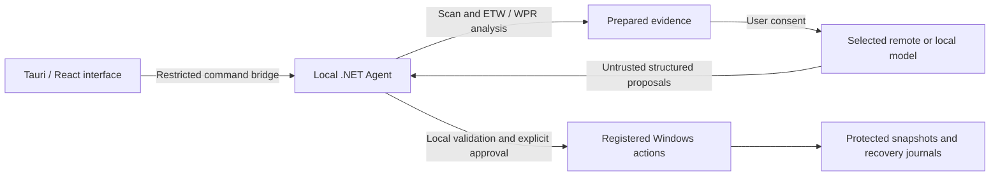

<div align="center">
  
  <p><strong>Measure first. Review the AI's proposal. Change only what you approve.</strong></p>
  <p>
    <a href="https://github.com/PrimeBuild-pc/NeuroTune/commits/main"></a>
    <a href="https://github.com/PrimeBuild-pc/NeuroTune/stargazers"></a>
    <a href="https://github.com/PrimeBuild-pc/NeuroTune/issues"></a>
  </p>
  <p>
    <a href="https://github.com/PrimeBuild-pc/NeuroTune/actions/workflows/build.yml"></a>
    <a href="LICENSE"></a>
    
    
    
    
    
    
  </p>
</div>

<p align="center"></p>

## What NeuroTune is

NeuroTune is a Windows 11 desktop app for investigating performance, latency and stability problems, then testing approved, reversible Windows changes. It combines **local measurements**, an **AI investigation** and a **typed execution engine**. It is not a one-click tweak pack: a recommendation is a hypothesis, not proof of a benefit.

> **v0.8.0-alpha.1 is an unsigned alpha for controlled testing, not a stable/general release.** Source security fixes still need a rebuilt, exact-candidate installer and fresh Windows 11 VM acceptance. Old installers, historical test results and a green build badge do not certify the current sources. Use a disposable VM for system-changing tests and keep an independent backup.

## How it works


```mermaid
flowchart TD
    A[Choose goal and running workload] --> B[Local scan]
    B --> C{Workload selected?}
    C -->|Yes| D[Three matching Baseline captures]
    C -->|No| E[One system-wide diagnostic]
    D --> F[Local trace analysis and quality checks]
    E --> F
    F --> G[Consented AI investigation and read-only follow-ups]
    G --> H[Review proposal - nothing applied]
    H --> I[Finish without changes]
    H -->|Valid workload Baseline and explicit approval| J[Recheck actions and create backups]
    J --> K[Apply and verify selected actions]
    K --> L[Restart if required]
    L --> M[Three matching Candidate captures]
    M --> N[Compare and choose Keep or Rollback]
    K -->|Failure or interruption| O[Verified rollback or visible recovery required]
```

1. **Collect locally.** Inventory covers hardware, Windows settings, drivers, devices, software and services. Choose overall performance, system latency, networking or stability; these specialize the AI prompt, not a preset list of tweaks. BIOS reading is a separate opt-in.
2. **Measure before diagnosis.** Complete diagnosis gives you time to return to an already-running game/app, records three Baselines and checks them locally. Neither AI runs during captures; decorative motion stops. Without a workload, one system-wide diagnostic can inform the investigation but **cannot unlock apply**. You must keep the scene and settings repeatable yourself.
3. **Investigate with consent.** Your selected model receives prepared evidence and may request bounded, fixed read-only Windows observations. It can challenge local heuristics. The default budget is 12 turns / 10 minutes, configurable within limits. Failure is reported, not replaced with a supposedly successful automatic plan.
4. **Review and approve.** Proposals show evidence, risk, uncertainty, trade-offs and reversal requirements. Select some registered actions, all available recommendations or none. High-risk actions require separate confirmation. Manual guidance and generated scripts have no execution path inside NeuroTune.
5. **Apply, verify, recover.** The engine checks availability, approval identity and conflicting selections, then creates a verified System Restore point, required Registry exports and original-state snapshots. It journals attempts and verifies changes. Failure triggers reverse-order rollback; incomplete recovery stays visible rather than being labelled success.
6. **Test the result.** Collect matching Candidates after any required restart. A 1+1 comparison is exploratory; the repeated decision gate needs at least 3+3 valid captures. Drift, invalid traces, missing coverage or new regressions must not become a favorable Keep recommendation. The AI can separately explain aggregates, but cannot change metrics or the user's decision.

For an interpretable experiment, test **one hypothesis/change at a time**. The engine can execute multiple approved, nonconflicting actions, but that does not isolate each action's contribution.

## Where the AI ends and Windows execution begins


```mermaid
flowchart LR
    UI[Tauri / React interface] -->|Restricted command bridge| AG[Local .NET Agent]
    AG -->|Scan and ETW / WPR analysis| EV[Prepared evidence]
    EV -->|User consent| AI[Selected remote or local model]
    AI -->|Untrusted structured proposals| AG
    AG -->|Local validation and explicit approval| EX[Registered Windows actions]
    EX --> JR[Protected snapshots and recovery journals]
```

| Boundary | What it means |
|---|---|
| AI is advisory | Exact evidence citations are checked, but they do not prove the model's interpretation or optimal tuning. Models cannot supply arbitrary commands, write paths or Registry targets. |
| Execution is local and bounded | Only registered `ActionId` implementations can write. Current capabilities include qualified power/core-parking, gaming/display, per-app GPU preference, page-file and memory/TDR/legacy TCP repair actions. Availability depends on the actual machine. |
| Backups are mandatory | Missing prerequisites, restore-point/backup failures or untrusted journals stop execution. Restore points and application rollback are not substitutes for an independent backup. |
| Privileged recovery is protected | Operation/run journals accept only trusted Administrators/SYSTEM ownership and permissions. Unsafe ACLs, reparse paths, corrupt identities and unsupported schemas are rejected, not silently repaired. |
| No hidden expansion of authority | Generated scripts stay inert. GPU IRQ-affinity candidates remain read-only; there is no generic BIOS writer, firmware flashing, security-disable shortcut or arbitrary cleanup. |

## Measurements: useful evidence, not universal proof

- ETW/WPR analysis provides scheduler Ready Time, per-core activity, ISR/DPC distributions, driver aggregates, hard pagefaults and local spike timelines. Raw traces are analyzed locally and deleted after successful analysis unless you choose to retain them.
- Scheduling and interrupt traces **do not measure FPS, ping/jitter or end-to-end input latency**. Interrupt-to-process latency and firmware/SMI stalls remain unmeasured; NeuroTune does not yet claim full LatencyMon parity.
- PresentMon-compatible CSV imports provide frame aggregates only with process attribution. They remain user-supplied evidence with **unverified session provenance**.
- A driver name, high spike, changed interrupt share or low-occupancy core is not causal proof. Unknown/missing data is not zero. Physical AMD/NVIDIA workload repeatability and exact recovery remain release gates.

## Providers, optional features and privacy

**Main AI:** OpenRouter, OpenAI API, Anthropic, DeepSeek, compatible custom APIs, or loopback servers such as Ollama, LM Studio and vLLM. Official browser authorization is available for OpenRouter and eligible ChatGPT plans/credits; availability and limits are provider-controlled. There is no automatic provider or API-billing fallback. See the [provider guide](docs/PROVIDERS.md).

Local scans, captures and numerical analysis do not call a model. Consented diagnosis sends prepared evidence to the **selected provider**; a local endpoint keeps that request local, while remote providers apply their own processing/retention policies. Raw ETL is never sent. Common identity/path redaction is best-effort, **not guaranteed anonymization**.

| Optional feature | Consent and limits |
|---|---|
| Supporting reports/screenshots | Up to 8 files, including 4 images, with prepared previews and separate transmission consent. Reports are inert text; images require model-vision/cost confirmation. **Pixels are not anonymized** and may be resent each turn. Report text/metadata persist locally; screenshot pixels are transient. User files do not become verified measurements. |
| System One assistant | Default-off topic advice via a managed local Rizzo component or a separately consented OpenRouter classifier. Local setup downloads multi-GB third-party assets; cloud use has separate credentials/costs. Neither can approve writes. No speed/accuracy guarantee; non-admin workers are not filesystem/network sandboxes. |
| BIOS inspection / SCEWIN | BIOS reads are opt-in. Offline imports are unverified. Export requires a user-supplied, hash-approved privileged package and additional consent; third-party drivers can affect the system. No AMI binaries are bundled, no protections are weakened and no BIOS write command is exposed. Live board compatibility remains unverified. |

Full formats, limits and evidence rules: [investigation boundaries](docs/DETERMINISTIC_CONTROLS.md). Third-party trust and acceptance: [optional components](docs/SCEWIN_SYSTEM_ONE.md).

## Local data and upgrades

| Location | Contents |
|---|---|
| `%LocalAppData%\NeuroTune` | Settings, DPAPI-encrypted API/OAuth credentials, redacted logs, measurement reports, optionally retained ETL and disposable caches/components. |
| `%ProgramData%\NeuroTune-journals\<Windows user SID>\operations` | Privileged operation manifests, original-state snapshots and required Registry exports. |
| `%ProgramData%\NeuroTune-journals\<Windows user SID>\runs` | Privileged run evidence, approvals, transitions, comparison decisions and recovery links. |

The protected journals use Administrators/SYSTEM access, bounded reads and flushed atomic replacement. Actual ACL denial, interruption and storage-failure behavior still require VM acceptance. DPAPI protects credentials for the Windows user; it does not defend against every compromised process/account or a tampered elevated executable.

**Before upgrading from legacy journals:** use the previous build to review/finish recovery, preserve independent backups and resolve prior writes, then archive the reviewed `%LocalAppData%\NeuroTune\operations` and `runs` directories. The new store does not import them and blocks journal operations while legacy entries remain. **Never delete pending recovery or copy old JSON into protected storage to bypass the gate.** See [SECURITY.md](SECURITY.md).

## Requirements and source builds

- A Microsoft-supported **Windows 11 x64** build and WebView2 runtime.
- Administrator privileges for the desktop app; System Protection enabled for applying changes.
- A supported model connection for AI diagnosis; not needed for local scan/measurement tools.
- For builds: .NET 8 SDK, Node.js 24, Rust stable and Visual Studio's C++ desktop workload.

From PowerShell:

```powershell
git clone https://github.com/PrimeBuild-pc/NeuroTune.git
cd NeuroTune
dotnet restore
dotnet build --configuration Release
cd ui
npm ci
npm test
npm run typecheck
npm run lint
npm run tauri dev
```

Launching the app requires the normal Windows UAC approval. Integration tests and writer/installer checks belong in a disposable VM; use the [test guide](docs/TESTING.md) rather than running system-changing tests on your primary PC.

To build and package an unsigned installer and portable archive:

```powershell
# From ui/
npm run tauri -- build --bundles nsis
cd ..
./scripts/package-release.ps1
```

CI produces the `NeuroTune-win-x64` artifact with a per-machine NSIS installer, a complete portable ZIP containing both self-contained agents, and `SHA256SUMS`. **Portable means no installation, not no elevation or no persistent data.** Optional model weights, SCEWIN tools and vendor drivers are not bundled. SHA-256 checks identify bytes; they do not authenticate an unsigned publisher or establish safety.

## Documentation and contributing

- [Security policy and upgrade safety](SECURITY.md) · [Alpha release notes](RELEASE_NOTES.md)
- [Test guide](docs/TESTING.md) · [Current gates and historical validation matrix](docs/VALIDATION_MATRIX.md)
- [Provider guide](docs/PROVIDERS.md) · [Investigation/execution boundaries](docs/DETERMINISTIC_CONTROLS.md)
- [Optional SCEWIN / System One](docs/SCEWIN_SYSTEM_ONE.md) · [Privacy and Windows security](docs/PRIVACY_SECURITY.md)
- Historical evidence: [local latency validation](docs/LOCAL_LATENCY_VALIDATION.md), [PawnIO trust review](docs/PAWNIO_TRUST_REVIEW.md), [repository privacy audit](docs/SECURITY_AUDIT_2026-08-02.md). These are scoped records, not current release certifications.

To contribute hardware inventory, use the [source-visible hardware collector](tools/hardware-collector/README.md). It runs offline without administrator rights, traces or settings changes. Review its dated JSON before sharing; inventory is not a performance benchmark.

NeuroTune is [MIT-licensed](LICENSE). Third-party packages and models retain their own licenses and trust requirements. Report vulnerabilities privately through [Security advisories](SECURITY.md), not public issues containing secrets or full PC profiles.
